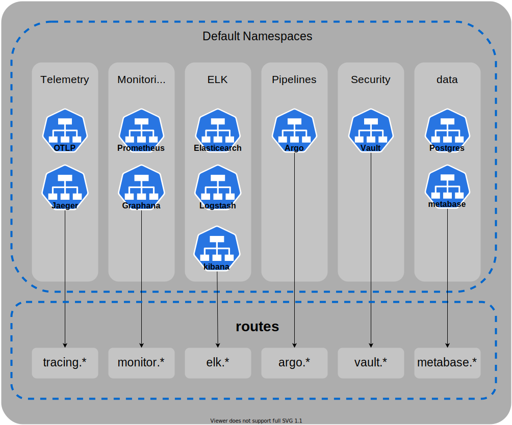

# default kubernetes cluster for local tests

this cluster run locally with kind for test integration between all services i develop with external services commonly used on enterprise development like:

integration with ELK Stack, distributed tracing, monnitoring with prometheus, integration pipelines, secret managment and etc.


> :info: this is not focused on have an high performe cluster to be copied into a real cluster, the purpose of this is be capable of check if the integration between the services works correcly.

> :warning: as mentioned before this project has the only purpose to test services locally, so the 
> security common necessities in kubernetes clusters will not be aborded.

## Get Started

``` sh
chmod +x ./setup_kind.shq
./setup_kind.sh -n <cluster_name>
```


## schemas

*** external services routes ***

